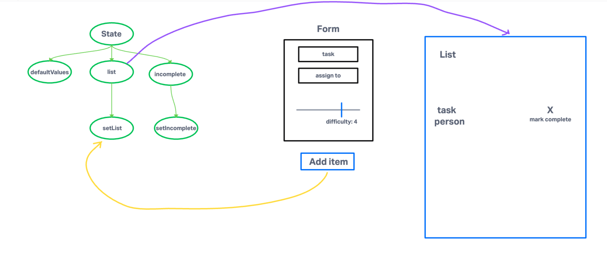

# To-Do App

## About

Frontend app built in React JS that allows user to create to-do lists.

Incorporates React Context API for state management.

## Version History

0.1.0, 15 May 2023 - Built app from previously developed starter code and obtained proof of life  
0.2.0, 16 May 2023 - Implemented React Context to manage settings, added pagination, styled app with Mantine  
0.3.0, 29 May 2023 - Todo list works, hides completed tasks, auth functionality doesn't work and is commented out, settings page doesn't work  

## Whiteboard

## Phase 1 Requirements

Create a settings Context component that can define how our components should display elements to the User.

Implement the React context API for defining settings across the entire application.

Create React Context for managing application display settings and provide this at the application level.
Add the following defaults to the context provider's state, they will not be changeable in this lab.
Display three items.
Hide completed items using a boolean.
Define "difficulty" as a default sort word to optionally use in the stretch goal.
Consume and utilize context values throughout your components.

Show a maximum of three items per screen by default in the <List /> component.
Use the Mantine <Pagination /> component to allow users to navigate a list of items.
Hide completed items in the list by default (the ability to show will be added in a later lab).
Pagination Notes:
Only display the first n items in the list, where n is the default number three from your settings context.
If you have more than n items in the list, the <Pagination /> component will add a button that, when clicked, will replace the list with the next n. items in the list.
the <Pagination /> component will manage the "previous" and "next" buttons upon correct implementation.

## Phase 2 Requirements

In Phase 2, we're going to extend the functionality of our application by allowing the user to make some decisions on how they would like the application to function. Specifically, we'll let them make changes to 2 settings.

Implement the Context API to make some basic application settings available to components.
How many To Do Items to show at once.
Whether or not to show completed items.
Hint: if reusing the custom useForm() hook, event validation may be necessary if using any Mantine component other than <TextInput />.
Provide the users with a form where they can change the values for those settings.
This should be given in the form of a new component, perhaps linked to from the main navigation.
Hint: Use Browser Router to create the page/route/component for this.
Once settings are updated, render the updated settings to the right of the "form". Consider using <Grid />, <Card />, and <When /> components.
Save the users choices in Local Storage.
Retrieve their preferences from Local Storage and apply them to the application on startup.

## Phase 3 Requirements

Implement a Login/Auth React Context, "protect" the To Do application by restricting access to the various application features based on the users' login status and capabilities.

Define a function that can simulate a login event.
Parameters: username and password as strings.
Sets a User on the auth context, and changes login status to true.
Define a function that can simulate a logout event.
Resets the User object and changes login status to `false.
Define a function that can authorize a User based on a capability.
Parameters: a capability as a string.
Returns a boolean whether the user has the capability parameter.
Create an <Auth /> component with the following features:

Given a capability prop of type string, conditionally render components based on the user stored in context.
Hide the entire interface until the user has logged in.
Implements the following RBAC rules:
Logged In Users with 'update' permissions can click the records to mark them as complete.
Logged In Users with 'create' permissions can create new items.
Logged In Users with 'delete' permissions can delete items.
Logged In Users with 'read' permissions can see the list of To Do Items.
Note: since only writers can 'create' and add new Todo items to state, in this lab, a person with read only access will not see any Todo items. This will change in the next lab once we populate Todo items from a database on page load.

Implement a <Login /> Component that has the following features:
Provide an account login screen with a form.
Accepts Username and Password.
On successful login, store the token as a cookie.
If a user returns and has a valid login cookie, hide the login form and consider them "Logged In".
Display a logout button instead of a form if they are "Logged In".

## Phase 4 Requirements

Alter the Add, Toggle Complete, and Delete functions within your to do application to use your API instead of in memory state.

Fetch the current list of items from the database on application start.
Whenever you add/update/delete an item, refresh the state so the user can instantly see the change.
Consider: Do you re-fetch from the server every time you make a change?
If so, how?
If not, how will you stay in sync?
Alter the Login Context to use the server to login users instead of our mock users list.

Be sure to store the token in state as well as in a cookie so you can reference it later.